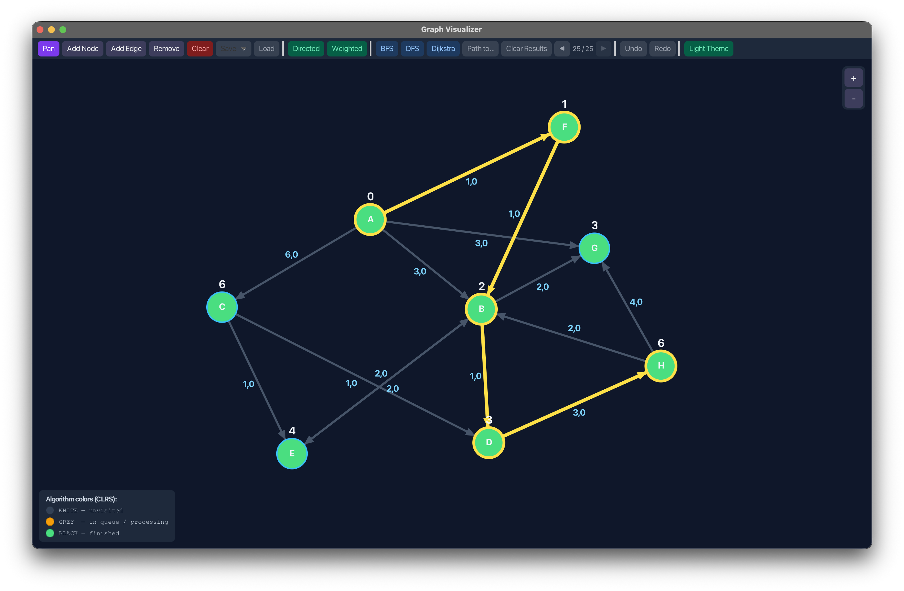

# Graph Visualizer
Standalone application to visualize graphs and algorithms on graphs.
 

 
## Prerequisites
- Java SDK 25
## Building
Use gradle to build and run the project automatically with:
```
./gradlew run
```
or just to build:
```
./gradlew build
```
To clear cache after build run:
```
./gradlew clean
```
 
## Testing
Run unit tests with:
```
./gradlew test
```
 
## Documentation
You can generate javadoc documentation with gradle:
```
./gradlew javadoc
```
You will find the generated docs in `app/build/docs/javadoc`.
 
